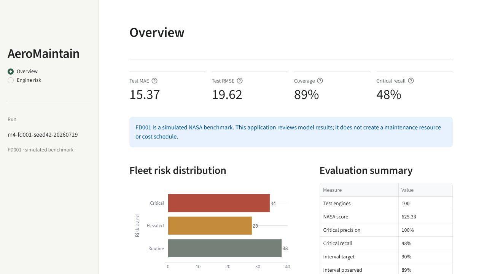
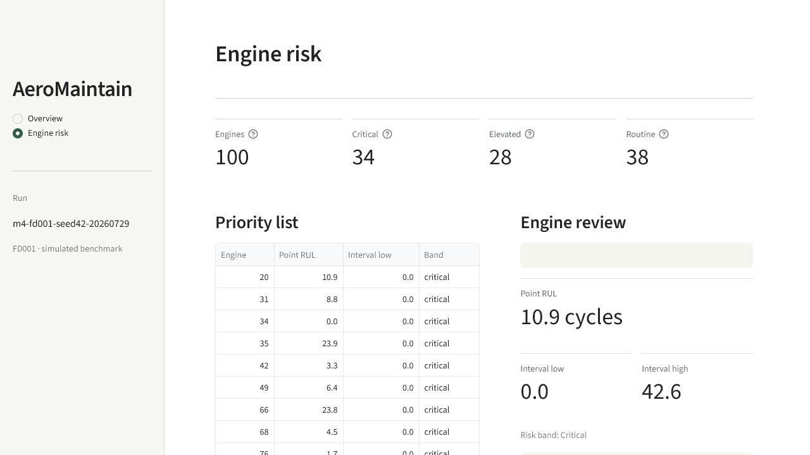

# AeroMaintain AI

[](https://github.com/EfeErim/aeromaintain-ai/actions/workflows/ci.yml)

Bir motorun sensör geçmişine bakarak kaç çalışma çevrimi ömrü kaldığını tahmin
edebilir miyiz? AeroMaintain AI bu soruyu, NASA'nın simülasyon tabanlı C-MAPSS
FD001 benchmark'ı üzerinde inceliyor.

Proje bir bakım planlama sistemi değil. Çıktısı; her test motoru için kalan
faydalı ömür (RUL) tahmini, ampirik tahmin aralığı, risk sırası ve modelin hangi
özelliklere ağırlık verdiğini gösteren yerel bir inceleme ekranıdır.

> FD001 gerçek uçak filosundan toplanmış veri değildir. Bu çalışma eğitim ve
> portföy amaçlıdır; uçuşa elverişlilik, bakım onayı veya gerçek filo kararı için
> kullanılamaz.

## Okuyunca ne göreceksiniz?

Proje baştan sona şu akışı uygular:

```text
NASA FD001 arşivini doğrula
    → motor bazında ayrılmış veriyi hazırla
    → Ridge ve XGBoost adaylarını aynı protokolle karşılaştır
    → modeli ve kalibrasyonu kilitle
    → ancak bundan sonra resmî test etiketlerini aç
    → sonuçları ve motor risk sırasını incele
```

Streamlit uygulaması iki sayfadan oluşur:

- **Overview:** kilitli test sonuçları, risk dağılımı ve deney kimliği;
- **Engine risk:** motor sırası, RUL aralığı, sensör geçmişi ve Ridge katsayıları.

| Overview | Engine risk |
|---|---|
| [](docs/screenshots/overview.png) | [](docs/screenshots/engine-health.png) |

## Veri ve deney tasarımı

FD001; 100 eğitim ve 100 test motoruna ait, simüle edilmiş run-to-failure
serileridir. Her satır bir motor çevrimindeki üç çalışma ayarını ve 21 sensör
değerini içerir.

Proje şu sızıntı kontrollerini uygular:

- ayrım ve çapraz doğrulama satırla değil motorla yapılır;
- rolling özellikler yalnızca mevcut ve geçmiş çevrimleri kullanır;
- ön işleme her fold'un yalnızca eğitim bölümünde öğrenilir;
- 20 kalibrasyon motoru model seçiminden ayrıdır;
- resmî test RUL etiketleri `model_lock.json` oluşmadan okunmaz;
- mevcut run klasörlerinin üzerine yazılmaz ve çıktı hash'leri doğrulanır.

Geliştirme karşılaştırmasında hedef ortalaması, Ridge ve sınırlandırılmış bir
XGBoost araması kullanıldı. XGBoost'un Ridge'e göre RMSE iyileşmesi `%1,76` ile
önceden belirlenen `%5` eşiğinin altında kaldığı ve NASA skoru kötüleştiği için
Ridge referans model olarak seçildi.

## Referans sonuç

Kilitli `m4-fd001-seed42-20260729` koşusu, 100 resmî FD001 test motorunda şu
sonuçları verdi:

| Metrik | Sonuç |
|---|---:|
| MAE | 15,37 çevrim |
| RMSE | 19,62 çevrim |
| Motor-normalize NASA skoru | 625,33 |
| Hedef / gözlenen aralık kapsaması | %90 / %89 |
| `prediction <= 30` kritik precision | %100 |
| `prediction <= 30` kritik recall | %48 |

`%48` recall önemli bir zayıflıktır: nokta tahmin eşiği, gerçekten kritik 25
motorun 13'ünü kaçırdı. Arayüz bu yüzden risk sırasını daha temkinli olan aralık
alt sınırıyla kurar. Bu aralık da güvenlik garantisi değildir.

[Ayrıntılı sonuçlar](docs/results.md) ve
[makinece okunabilir toplu kanıt](docs/reference_evidence.json) repoda yer alır.

## Neden çizelgeleme yok?

İlk sürümde bakım süresi, teknisyen, hangar, parça, kapasite ve maliyet alanları
uydurulmuş değerlerle oluşturuluyordu. Araştırmada gerçek uçuş ve bakım olayları
içeren kaynaklar bulundu; ancak aynı olaylar için bu operasyonel alanları birlikte
sağlayan, savunulabilir bir açık veri seti bulunamadı. Bu nedenle sentetik senaryo,
maliyet/politika karşılaştırmaları ve CP-SAT bakım çizelgesi aktif kapsamdan
çıkarıldı. Ayrıntılı kaynak ve karar kaydı için
[gerçek veri kapsam incelemesine](docs/real_data_scope.md) bakın.

NGAFID gibi gerçek uçuş verileri değerli bir sonraki çalışma olabilir; fakat
hedefi, veri hacmi ve problem tanımı FD001 RUL regresyonundan farklıdır. Bu repoda
iki ayrı problemi sessizce birbirine karıştırmak yerine mevcut benchmark'ın
sınırları açık tutulur.

## Yerelde çalıştırma

Python `>=3.11,<3.12` gerekir. PowerShell'de:

```powershell
git clone https://github.com/EfeErim/aeromaintain-ai.git
cd aeromaintain-ai
py -3.11 -m venv .venv
.\.venv\Scripts\Activate.ps1
python -m pip install -c constraints/python311-tested.txt -e .
aeromaintain doctor
aeromaintain pipeline --run-id fd001-demo
aeromaintain app --run-id fd001-demo
```

`pipeline`, NASA arşivi yerelde yoksa indirir; boyutunu ve SHA-256 değerini
doğrular, veriyi hazırlar, modeli seçip kilitler, resmî değerlendirmeyi çalıştırır
ve raporu üretir. Ham NASA verileri, satır düzeyindeki türev tablolar, model
dosyaları ve run klasörleri Git'e eklenmez.

Kalite kapısı:

```powershell
python -m pip install -c constraints/python311-tested.txt -e ".[dev]"
ruff check .
ruff format --check .
pytest --cov=src/aeromaintain --cov-fail-under=80
```

## Belgeler

- [Referans sonuçlar](docs/results.md)
- [RUL model kartı](docs/model_card.md)
- [FD001 veri kartı](docs/data_card.md)
- [Mimari ve güven sınırları](docs/architecture.md)
- [Araştırma temeli](docs/research.md)
- [Gerçek veri kapsam incelemesi](docs/real_data_scope.md)

## Sınırlar

- FD001 tek bir simüle çalışma koşulu ve tek bir simüle arıza modu içerir.
- Sonuçlar gerçek filo telemetrisine genellenemez.
- Nominal ampirik aralık güvenlik garantisi değildir.
- Nokta tahmininin kritik-RUL recall değeri sabit test setinde yalnızca `%48`'dir.
- Proje bakım kaynağı, maliyet veya uygulanabilir çizelge üretmez.

## Lisans

Proje kodu ve belgeleri MIT lisanslıdır. Bu lisans NASA kaynak verisini yeniden
dağıtma hakkı vermez.
