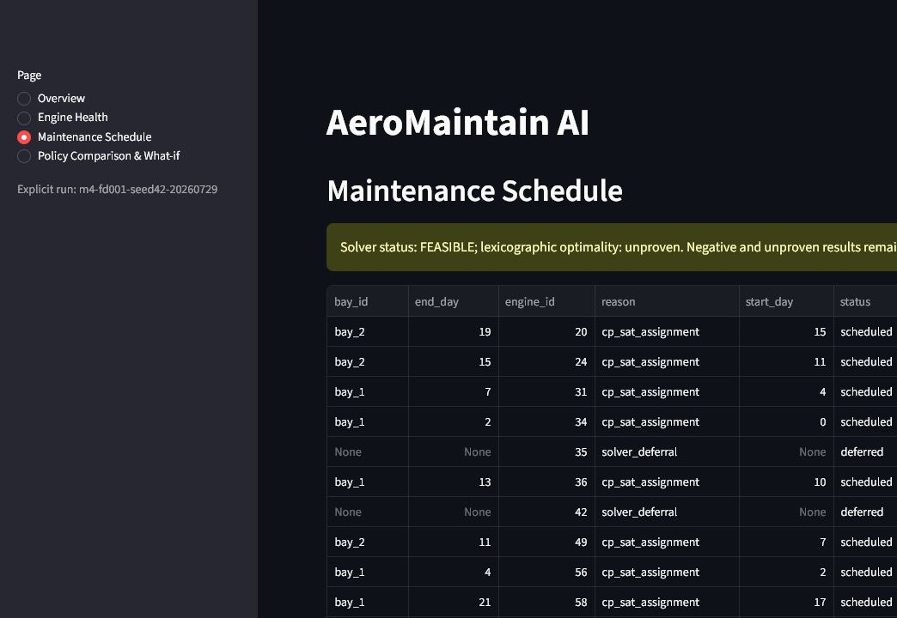
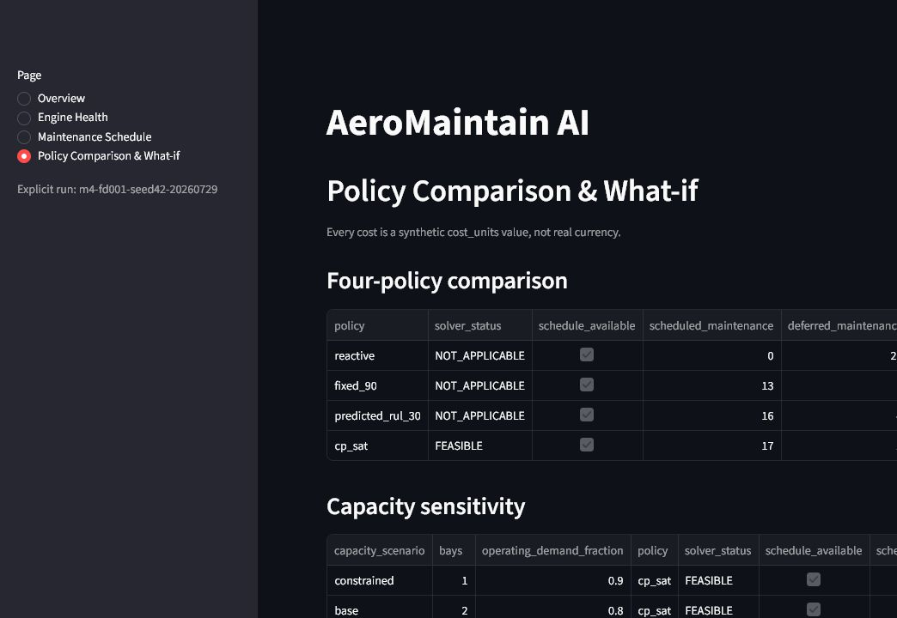

# AeroMaintain AI

AeroMaintain AI is a local educational prototype that predicts remaining useful
life (RUL) from NASA C-MAPSS FD001 sensor histories and converts those
predictions into a synthetic, capacity-constrained maintenance schedule.

The project is designed to demonstrate a careful prediction-to-decision
workflow:

1. leakage-resistant RUL modeling;
2. nominal empirical uncertainty and model explanation; and
3. maintenance scheduling under team, bay, parts, and operating-demand
   constraints.

It is not an airworthiness, maintenance-approval, or production fleet system.

## Current delivery

Phases 0 through 4 are complete. One immutable command now runs verified FD001
preparation, leakage-safe model selection and lock, official evaluation,
synthetic maintenance optimization, and final reporting. A four-page Streamlit
application verifies the complete artefact hash chain before exposing risk,
schedule, policy-comparison, CSV-download, and truth-free capacity what-if
views.

The detailed product and experiment contract is
[`PROJECT_PLAN.md`](PROJECT_PLAN.md). Evidence-based milestone status is in
[`PROJECT_STATE.md`](PROJECT_STATE.md).

## Data boundary

V1 uses only NASA's simulated C-MAPSS `FD001` subset. It is not operational
fleet telemetry. The NASA dataset page currently does not specify a
redistribution license, so raw archives and extracted files are never committed
or attached to releases.

- [Research basis and method sources](docs/research.md)
- [FD001 data card and governance rules](docs/data_card.md)

All maintenance duration, staffing, bay, part, demand, and cost fields are
synthetic. Costs are reported as `cost_units`, not real currency.

## Requirements and installation

- Python `>=3.11,<3.12`
- Git

PowerShell:

```powershell
Set-Location 'D:\kişisel projeler\02-aeromaintain-ai'
py -3.11 -m venv .venv
.\.venv\Scripts\Activate.ps1
python -m pip install --upgrade pip
python -m pip install -e ".[dev]"
```

Check the environment:

```powershell
aeromaintain doctor
```

The same CLI can be invoked without the console-script wrapper:

```powershell
python -m aeromaintain doctor
```

## Prepare FD001

Download the frozen NASA archive, verify its size and SHA-256, safely select
only the FD001 members, and generate the validated tables and reports:

```powershell
aeromaintain prepare
```

An already downloaded archive can be supplied explicitly:

```powershell
aeromaintain prepare --archive 'C:\path\to\CMAPSSData.zip'
```

The command fails closed on a changed archive, unsafe ZIP path, invalid data
contract, or conflicting existing output. A repeat run with the same inputs
verifies and reuses byte-identical files under `data/processed/fd001/`.
Generated outputs include:

- train and test Parquet tables;
- uncapped and capped train RUL targets;
- the deterministic development/calibration split manifest;
- a data-quality report and development-only EDA report; and
- official test labels isolated under `evaluation/` for later locked
  evaluation.

The NASA archive, extracted members, processed tables, and reports remain
Git-ignored local data.

## Train, lock, and evaluate RUL

Create a new immutable modeling run. The command uses only development engines
for five engine-grouped folds, compares the development target mean, four Ridge
candidates, and 12 bounded XGBoost candidates, then calibrates one score per
calibration engine:

```powershell
aeromaintain train --run-id m2-fd001-seed42
```

The run records the 403 causal feature names and order, fold-local preprocessing
decisions, common metrics, XGBoost early-stopping results, automatic champion
decision, nominal 90% empirical interval, model-behavior explanation, trusted
local model hash, and `model_lock.json`. XGBoost becomes champion only when it
improves development RMSE over Ridge by at least 5% without worsening the
motor-normalized NASA score.

Official test labels are read only by the evaluation command, after the lock
and every referenced data, config, feature, and model hash have been verified:

```powershell
aeromaintain evaluate --run-id m2-fd001-seed42
```

The evaluation writes per-engine predictions, interval and risk bands, official
MAE/RMSE/NASA metrics, critical-RUL precision/recall/F1, interval coverage, and
visible error analysis under the run's `official_test/` directory. Repeating
evaluation with the same valid lock reuses only byte-identical outputs. The
interval is empirical and nominal; it is not a safety guarantee.

## Optimize synthetic maintenance

Use a run whose official predictions and model lock have already been
verified:

```powershell
aeromaintain optimize --run-id m2-fd001-seed42
```

The command selects the 20 engines with the lowest interval lower bounds,
generates the seed-42 synthetic 30-day fleet and resource scenario, and writes
the reactive, fixed-90-cycle, predicted-RUL-30, and CP-SAT schedules under the
run's `optimization/` directory. It also records policy and
base/constrained/expanded capacity comparisons in JSON and CSV.

The optimizer never receives official true RUL. True RUL is joined only after
each schedule is frozen, in a separate retrospective evaluator used to report
simulated failures and emergency `cost_units`. `FEASIBLE`, `UNKNOWN`,
`INFEASIBLE`, and unproven-optimality outcomes remain visible; a no-solution
status never produces a plausible-looking schedule. See
[the optimization method and verified M3 results](docs/optimization.md).

## End-to-end release workflow

Run the complete workflow with a new run ID:

```powershell
aeromaintain pipeline --run-id m4-fd001-seed42
```

An already downloaded and verified archive can be supplied with `--archive`.
The command refuses to overwrite an existing run. A model-locked run left by a
later-stage failure is not marked `pipeline_complete`; successful runs retain
data, config, model-lock, evaluation, optimization, and report hashes in
`manifest.json`.

Open one explicitly named, verified run:

```powershell
aeromaintain app --run-id m4-fd001-seed42
```

Run a non-interactive Streamlit render check:

```powershell
aeromaintain app --run-id m4-fd001-seed42 --smoke
```

The application never trains a model and never exposes official true RUL in a
decision view. It rejects missing, changed, externally referenced, or
truth-leaking artefacts before rendering. Capacity what-if inputs are limited
to 1–3 bays and 70%–90% minimum operating demand before CP-SAT is invoked.

## Verified release-candidate result

The local `m4-fd001-seed42-20260729` run completed the full pipeline. Ridge
remained champion. Official-test MAE was `15.369728`, RMSE was `19.622062`, and
the nominal 90% empirical interval observed `0.89` coverage. The base CP-SAT
schedule was `FEASIBLE`, not proven optimal: 17 maintenance jobs were scheduled
and 3 due jobs were deferred.

These are experimental results on simulated FD001 data and synthetic planning
assumptions. See the [full results](docs/results.md),
[model card](docs/model_card.md), and [architecture](docs/architecture.md).

## Application screenshots






## Quality checks

```powershell
ruff check .
ruff format --check .
pytest
pytest --cov=src/aeromaintain --cov-report=term-missing --cov-fail-under=80
```

GitHub Actions runs the same checks on Ubuntu with Python 3.11. CI uses
synthetic smoke fixtures and does not download NASA data.

## Repository structure

```text
src/aeromaintain/
  data/          # acquisition, validation, parsing, and split logic
  features/      # causal rolling features
  models/        # baselines, XGBoost, uncertainty, and model lock
  optimization/  # scenarios, policies, and CP-SAT scheduling
  evaluation/    # prediction and retrospective decision metrics
  app/           # Streamlit application
  cli.py
  config.py
configs/
docs/
notebooks/       # exploration and visualization only
tests/
data/raw/        # local only; Git ignored
data/processed/  # local only; Git ignored
artifacts/       # local only; Git ignored
runs/            # local only; Git ignored
```

Reusable data, metric, model, and solver logic belongs in
`src/aeromaintain/`. Notebooks remain exploratory.

## CLI contract

```text
aeromaintain prepare
aeromaintain train --run-id ID
aeromaintain evaluate --run-id ID
aeromaintain optimize --run-id ID
aeromaintain pipeline --run-id ID
aeromaintain app --run-id ID
aeromaintain doctor
```

All commands are implemented. Generated outputs remain local and Git-ignored.
Commands do not overwrite existing generated outputs; completed runs retain
config, seed, data/model hashes, metrics, and report identities in their
manifests.

## License

Project code and documentation are licensed under the MIT License. This does
not grant rights to redistribute NASA source data.
