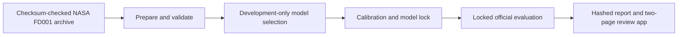

# Architecture

## Evaluation flow

Reusable logic lives under `src/aeromaintain/`; notebooks are exploratory only:

- `data/pipeline.py` verifies and prepares FD001;
- `features/causal.py` creates past-and-current-only rolling features;
- `models/rul.py` selects, calibrates, persists, and locks the model;
- `models/evaluation.py` validates the lock before opening official labels;
- `delivery.py` runs preparation through the report and marks completion only
  after all stages pass;
- `app/artifacts.py` verifies the hash chain and exposes a prediction schema
  without true RUL; and
- `app/main.py` renders Overview and Engine risk.

## Trust boundaries

Training uses development engines only. Calibration uses a disjoint engine set
after model selection. Official test labels are opened only after
`model_lock.json` and every referenced file pass hash validation. The public
review table deliberately excludes `rul_true`.

The project does not create operational maintenance fields or a schedule. This
removes the previous boundary where predictions were combined with invented
resources, durations, costs, and policies.

## Run state

Model training creates a new run and refuses an existing ID. Evaluation adds a
separately verified artefact group. The end-to-end workflow writes
`report.json` and `report.html`, then atomically changes the run manifest from
`model_locked` to `pipeline_complete`. A failure before that replacement remains
visibly incomplete.

The application requires an explicit run ID and checks:

1. run and model-lock identity;
2. locked data, config, model, explanation, and feature hashes;
3. official-evaluation hashes; and
4. report hashes for pipeline-complete runs.

`runtime.py` also records the Python, platform, installed distributions, and
tested-constraints hash for new runs.
