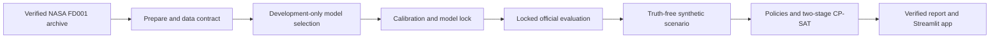

# Architecture

## Prediction-to-decision flow

Reusable logic lives under `src/aeromaintain/`; notebooks are exploratory only.
The CLI is the orchestration surface:

- `data/pipeline.py` verifies and prepares FD001;
- `features/causal.py` creates past-and-current-only rolling features;
- `models/rul.py` selects, calibrates, persists, locks, and evaluates the model;
- `optimization/maintenance.py` generates synthetic scenarios, evaluates
  baseline policies, and solves the capacity-constrained schedule;
- `delivery.py` runs prepare through report and marks completion only at the end;
- `app/artifacts.py` verifies the hash chain and removes true-RUL fields from
  decision views; and
- `app/main.py` renders the four-page Streamlit interface.

## Trust boundaries

Training uses development engines only. Calibration uses a disjoint engine set
only after model selection. Official test labels are opened only after
`model_lock.json` and its referenced files pass hash validation.

The optimizer receives engine ID, observed cycle, point prediction, nominal
empirical interval, risk band, and documented synthetic resource fields. True
test RUL is joined only after a schedule is frozen, by the retrospective
evaluator. The Streamlit loader deliberately selects a safe prediction schema
that excludes `rul_true`.

## Run state

Model training creates a new run atomically and refuses an existing ID.
Evaluation and optimization add separately verified artefact groups. The
end-to-end command writes `report.json` and `report.html`, then atomically changes
the run manifest from `model_locked` to `pipeline_complete`. A failure before
that final replacement remains visibly incomplete and cannot be resumed by
silently overwriting the run.

The application requires an explicit run ID. It checks:

1. run and model-lock identity;
2. locked model, data, and config SHA-256 values;
3. official-evaluation hashes;
4. optimization source and output hashes;
5. pipeline report hashes for completed pipeline runs; and
6. absence of true-RUL fields in the planning scenario.

## Solver shape

The CP-SAT model assigns each maintenance job to one start day, team, and bay or
explicitly defers it. It enforces full-duration team and bay capacity, parts
balance, minimum operating demand, and horizon completion. Stage 1 minimizes due
deferrals and lateness; stage 2 fixes the best stage-1 score found and minimizes
documented synthetic operational cost. `FEASIBLE` is reported as feasible with
unproven lexicographic optimality, never as optimal.
